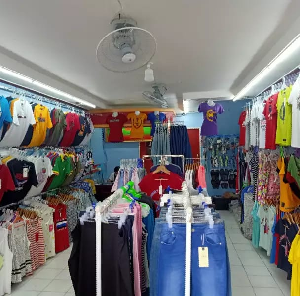

# dhakabanglaexport
<!DOCTYPE html>
<html>
<head>

</head>
<body>

<ul>
  <li><a class="active" href="#home">Home</a></li>
  
  <li><a href="https://atikblog.github.io/bazar3/">Contact</a></li>
  <li><a href="https://atikblog.github.io/online-shoping/">Online shop</a></li>
</ul>

</body>
 
    
 <h1>ঢাকা বাংলা ১০০% এক্সপোর্ট স্টোক লট কেনা ও বেচা।</h1> 

  
  </head> 
  <body>

    
    
    
    </body>
    
        
    

   <p1>ঢাকা বাংলা স্টোক একটি নির্ভর যোগ্য প্রতিষ্ঠান সুনামের সাথে আমরা মান সম্মত পোশাক কেনা ও বেচা করে থাকি।সততা আর নিষ্ঠার সাথে আজ আমরা এত দূর পর্যন্ত আসতে পেরেছি।আমাদের প্রতিষ্ঠানের নামে তেমন কোন খারাপ মন্তব্য এখনো শোনা যায় নি।আমরা আপনাদের সেবায় সর্বোদা নিয়জিত।দেশী,বিদেশী সকল পোশাকের আস্থা অর্জন কারি এক মাত্র প্রতিষ্ঠান ঢাকা বাংলা এক্সপোর্ট।</p1> 

   আমাদের যেসব পণ্য রয়েছে তা নিম্নে দেওয়া হল: 
  <li>গেঞ্জি</li> 
  <li>জিন্স</li> 
  <li>শার্ট</li> 

 

  <p2>আমাদের দোকানের পন্য দেখতে নিচের link visit করুন: </p2> 

 
   <a href= 
  "https://atikblog.github.io/online-shoping/"> click here </a>
   

</html>

